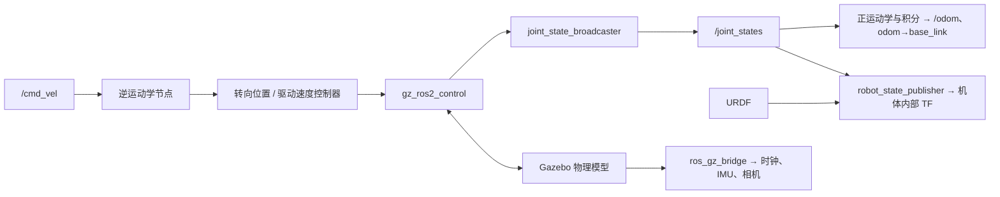

# 参考项目架构

更新日期：2026-10-08。以下为 [OVERVIEW.md](OVERVIEW.md) 中基准提交的静态分析；本项目自己的包划分和启动方案尚未确定。

## 模块与源码入口

| 参考文件 | 职责 |
| --- | --- |
| [robot.urdf.xacro](../REF/omnidirectional_four_wheeled_robot/urdf/robot.urdf.xacro) | 组合机体、四轮、传感器和 ros2_control 配置 |
| [wheel.urdf.xacro](../REF/omnidirectional_four_wheeled_robot/urdf/wheel.urdf.xacro) | 每个轮组的转向/驱动关节、几何、惯量和控制接口 |
| [empty.sdf](../REF/omnidirectional_four_wheeled_robot/worlds/empty.sdf) | 地面、光照、物理、场景、传感器与 IMU 系统 |
| [gazebo.launch.py](../REF/omnidirectional_four_wheeled_robot/launch/gazebo.launch.py) | 展开 Xacro，启动 Gazebo、状态发布器、桥接、控制器、运动学和里程计；可选 GUI/RViz |
| [display.launch.py](../REF/omnidirectional_four_wheeled_robot/launch/display.launch.py) | 独立模型显示入口，与物理仿真入口分开 |
| [controller_kinematics.cpp](../REF/omnidirectional_four_wheeled_robot/src/controller_kinematics.cpp) | 机体速度到四轮转角/轮速的逆运动学节点 |
| [odometry_publisher.cpp](../REF/omnidirectional_four_wheeled_robot/src/odometry_publisher.cpp) | 实测关节状态到平面速度、位姿积分、里程计及 TF |
| [robot_geometry.hpp](../REF/omnidirectional_four_wheeled_robot/include/omnidirectional_four_wheeled_robot/robot_geometry.hpp) | C++ 正逆运动学共用的轮位、半径、顺序常量 |

## 参考数据流

参考 launch 由 `gz_ros2_control` 在 Gazebo 中创建控制管理器，模型生成进程退出后调起 joint_state_broadcaster，再调起位置和速度控制器。事件触发并不等于所有前置条件已验证成功。机器人和示例球体均由 `ros_gz_sim/create` 生成。

另有 [spawner_sphere.cpp](../REF/omnidirectional_four_wheeled_robot/src/spawner_sphere.cpp) 可执行程序，使用 ROS SpawnEntity 服务；主 Gazebo launch 并未启动这个自定义程序，不应混淆两条生成路径。

## 运动学阅读要点

- 逆解对第 i 轮计算 `vxi = vx - yi * wz`、`vyi = vy + xi * wz`，由 atan2 得到转向目标，再通过翻转角度与轮速缩短转向变化。参考节点按 10 Hz 墙上时间定时发布，控制管理器配置为 100 Hz。
- 上一转角保存在逆解节点中，是上次目标，不是关节反馈。低速度分支保留角度；命令超时、限速和实际转向过程需要另行验证。
- 正解使用反馈转角与轮速，根据四轮对称布局求平面速度，再按 JointState 时间戳进行中点积分；缺少所需关节或时间增量异常时跳过更新。
- 正逆解共享 C++ 几何常量，但 URDF 仍单独写有对应参数。两处一致性需要维护，不能视为已经实现单一参数源。

## 尚未包含的能力

当前参考树未提供本项目所需的完整 SLAM、已知地图定位、Nav2 规划/跟踪与自主导航配置。它提供模型、底盘控制和里程计参考；最终系统如何组合成熟组件与自研算法，待用户逐步确定。
